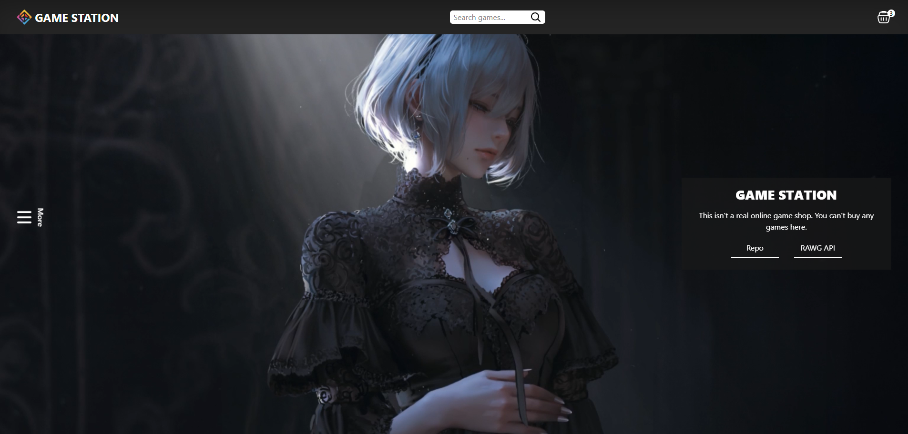
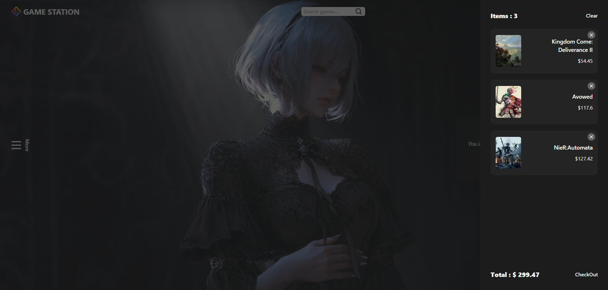
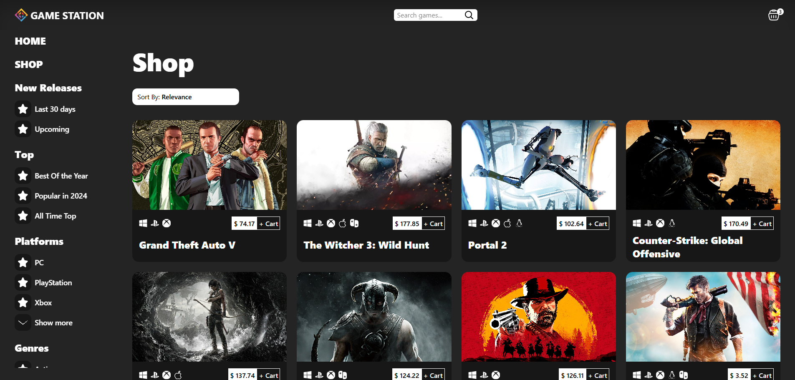
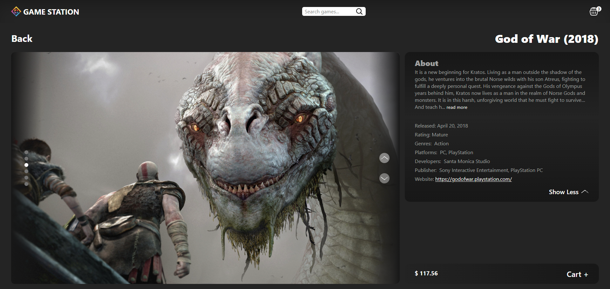

# Game-Station

### [Live Demo](https://game-station-xxx.netlify.app/)

## About

A mock game shopping cart built with react.

## Built With

-   React
-   TypeScript
-   HTML
-   Tailwind CSS
-   Tan Stack
-   Framer-Motion

## Features

-   Extensive catalog of games thanks to the [RAWG API](https://rawg.io/)
-   Search Any Game
-   Game information and screenshots
-   Responsive design
-   Filters to find exact genre or release period.
-   Cart for games user wants to 'buy'

## Screenshots

